# Bar Quiz

## Introduction

Welcome to [Bar Quiz](https://mrbertieg.github.io/bar-quiz/index.html) website!

Bar Quiz is an interractive website designed to engage with users and test their general knowlege on what the classic cocktails are made of.

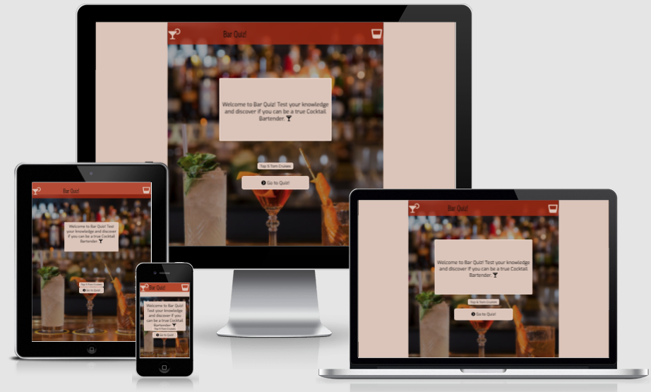
  

## <a name="top">Table of Contents</a>

### [1. User Experience](#user-ex) 
- User Expectations
- Design Approach
- Returning Users
### [2. Features](#features)
- Navigation Bar
- Home Page
- Quiz Page
- End Page
- Leaderboard Page
- Social Media Links
- Rules Window
- Contact Window
### [3. Wireframe](#wireframe)
### [4. Deployment](#deployment)
### [5. Manual Testing](#manual-testing)
### [6. Technologies Used](#tech-used)
### [7. Bugs](#bugs)
### [8. Credits](#credits)

  

[Top of the page](#top)

## <a name="user-ex">1. User Experience</a>

### User Expectations
The main goal of this quiz is to establish if users know what a classick cocktail is made of. At the end of each quiz users will be given a score and compare themselvs against other users. 

### A new user:
A user visiting the page for the first time will be able to understand what to do and be able to navigate the page with ease.  

### A returning user:
A returning user will be able to jump directly to the Leaderboard on the main page and see what the top score is before starting the quiz themselves.  

### A frequesnt user:
A frequesnt user would want to knwo of any n ew questions have been added to the quiz and compare scores(localy).

  

[Top of the page](#top)
## <a name="features">2. Features</a>

### Navigation 

- The navigation bar has four different versions depending on which page the user is on, and on what size screen the user is using. 

Mobile Home Page

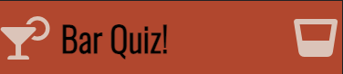

Mobile Quiz Page

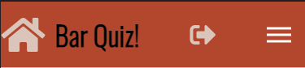

Mobile Overlay Effect when pressing the menu

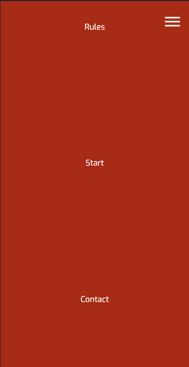

Mobile Exit Button With Modal Window 

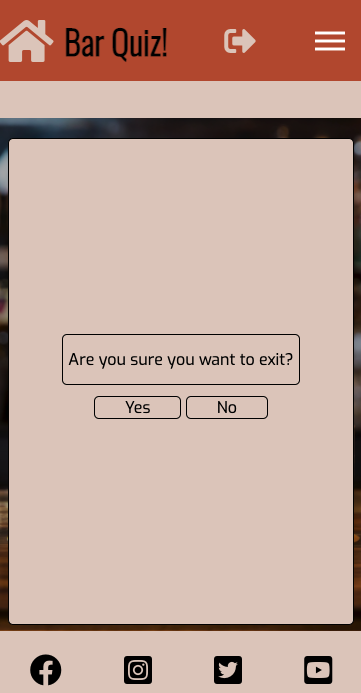

User can decide if they wish to exit the page they are in by clicking the exit button. This will take them to the main home page.

  

Mobile Leaderboard and End Page  
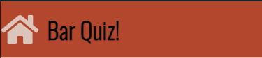
 
The reason why no menu option is offered here is because the user has the options presented to them in the Leaderboard page as a button. 

Big Screen Quiz Page

In screens bigger than 500px the nav bar menu has a animation effect where text increases size and changes colour. 
  

### Home Page

Both Mobile and Desktop consit in having the following:
-  Header with the title of the website. 
- An introduction box with a brief description. 
- A link to the highest score users under the button "Top 5 Tom Cruises". 
- A "Go to Quiz" button which will take the user to the quiz page.
- A footer containing four social media links which open in individual pages.
 

Mobile 
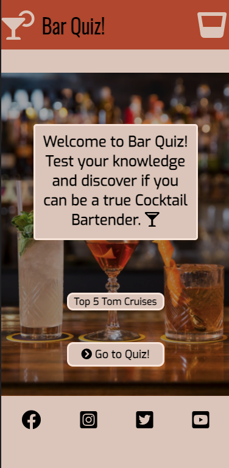
 

Desktop 
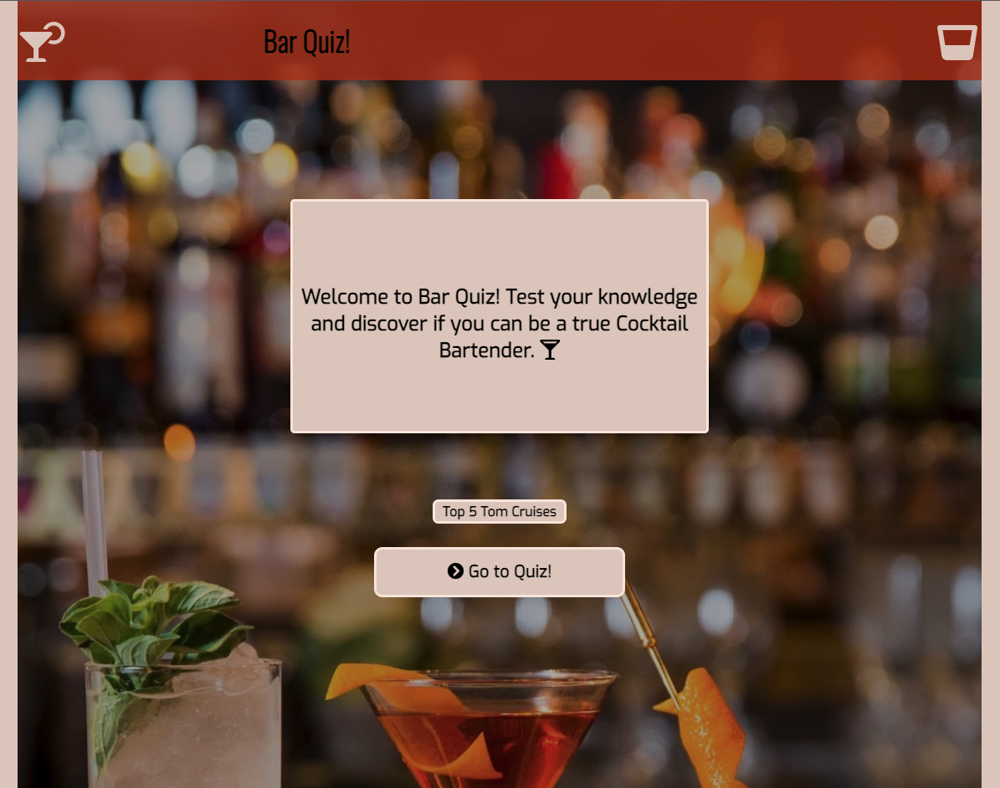

  

### Quiz Page

Both Mobile and Desktop contain similar features such as a description box with the rules of the quiz, a button which allows the user to take the test and the footer with the social media links. There are a few differences between Mobile and Desktop.

Mobile  
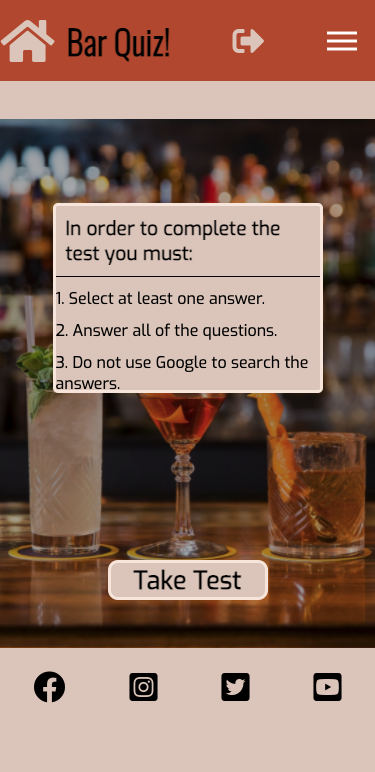
 
In the mobile version a menu bar appears on the right top corner of the page. This allows the user to see the 3 different options presented to them via an overlay animation effect. These 3 options are:
- Rules
    - When clicked a popup window appears with the rules of the quiz.
    - To exit the window the user can click the X symbol. 
      
 
- Start 
    - The user can start the quiz from here as well. 
    - The quiz can be closed via the X button but no warning will be shown here. 

  
 
- Contact
    - The user can open the contact window and enter any feedback.
    - The contact window can be close via the X button. 

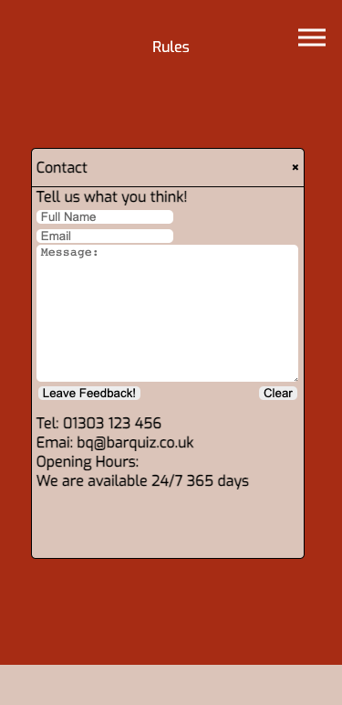  
  
Desktop  
In the desktop version the hamburger menu has now disapeared and has been replaced with 3 navigation links that animate when the page first loads. The links have the same functions as in the mobile version with the exception of the cursor being a pointer.  

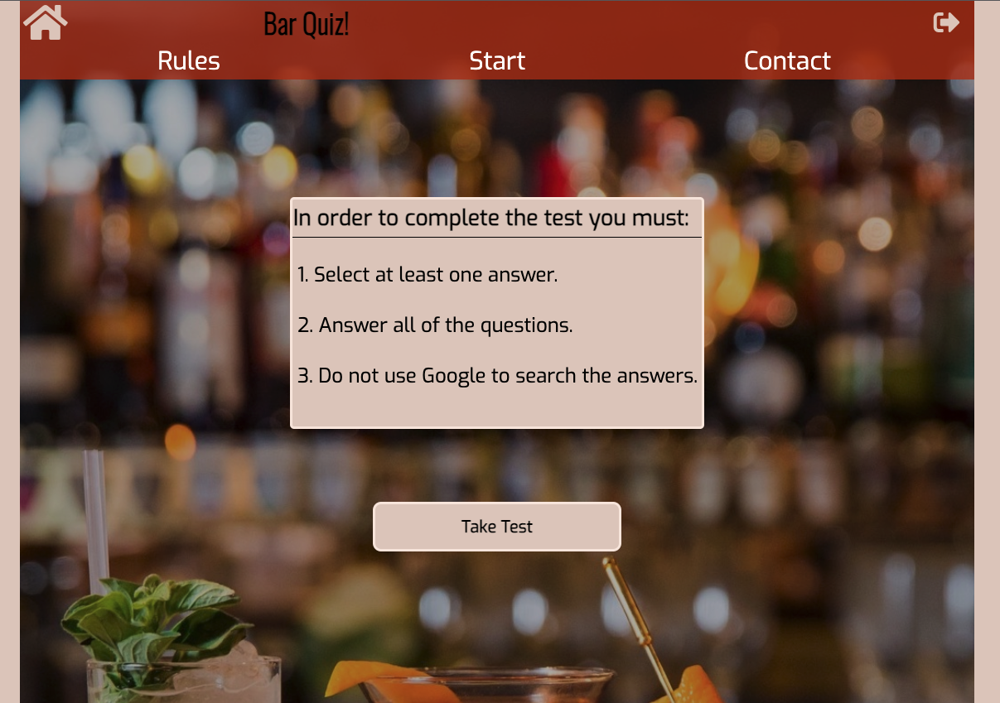  
  
- Exit Button 
Both in Mobile and desktop the exit button appears if the user presses the symbol. If the user chooses "Yes" then the home page will relload. If the user chooses "No" then the window will close and the user can carry on. 

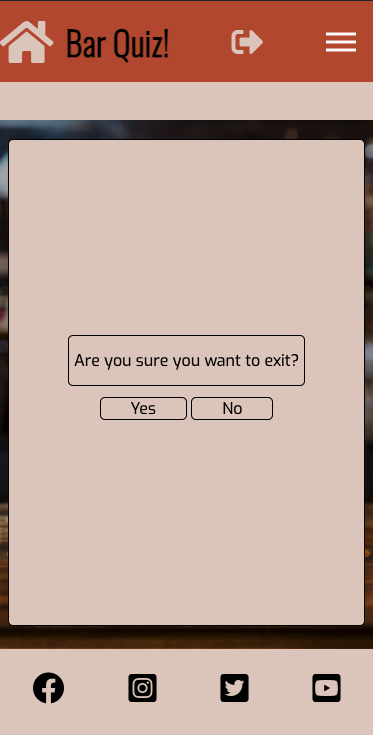  

The Quiz 
When the user clicks the "Take Test" button the below window will appear. The user will then be presented with a question and four options. If the user clickes the correct answer then the question will highlight green, the Score will increase by 100 points and the next question will load.  
If the user selects the wrong answer then no point will be assigned, the next question will load and the answer will turn red.  

In the desktop version the options have a hover effect where the answers scale up when hovered over.

If the user decides to close the quiz window then they can choose to do so by clicking the X button, however the quiz will still be on the same question where it was left if the user then decised to carry on with the quiz just by simply clicking "Take Test" again and the quiz will reappear.  
If the user wishes to exit at any stage then they can press the exit symbol. At this stage the page will reload and the progress will be lost. 
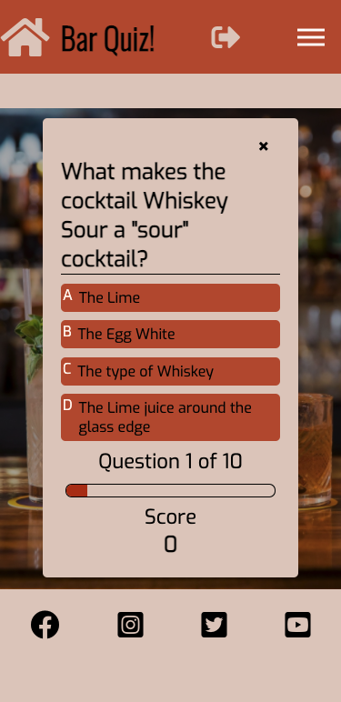 
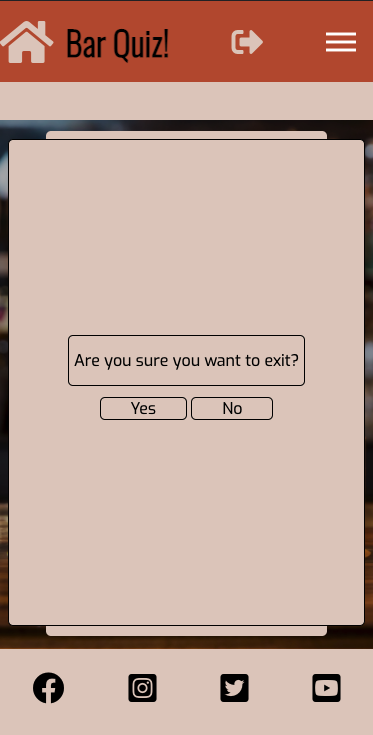 
 
End of the Quiz 
At the end of the quiz, mobile version or desktop, the user is presented with their final score and 3 options:
- Save the score. Where the Score will be saved locally and presented in the Leaderboard Page.
- Play Again, where the quiz will restart without saving the score.
- Go to the Home Page without saving the score.  
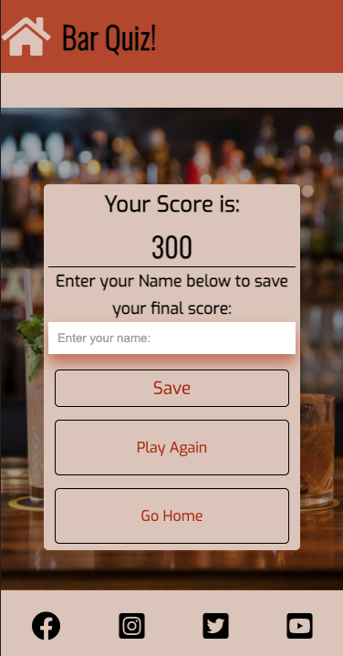
  

Leaderboard Page
 
After the user has completed the quiz and saved the score, they are able to see how their resul copares to previous users or attempts. It is worth mentioning this can be seen only if the quiz is taken on the same device(locally).  
 
Social Media Links
 
Theare are 4 icons on each page which open in new separate tabs individually
 
- Facebook
- Instagram
- Twitter
- Youtube
  
Rules Window  
The Rules window can be accessed by pressing the  and then selecting Rules. The following window will appear.  
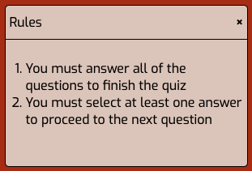  
To exit the window simply press the X button. 
  
Contact Window  
The Contact Window can be accessed by pressing the  and then selectin Contact. The following window will appear.  
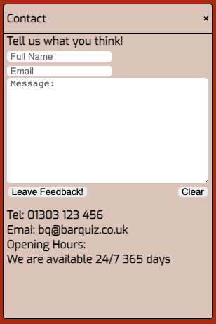 
To exit the window simply press the X button.  

For Desktop sites simply select the category from the navigation bar. 
  

 

[Top of the page](#top)

### 3. Wireframe 

- The website's skeleton was designed using Balsamiq
- Three versions were designed: Mobile, Tablet and Web Browser.
- Although the Website is not 100% identical to the wireframe, this has proven to be a useful tool in establishing how the website will be designed.  
- The final colour cheame was choosed by using the Landing's picture color scheme. 
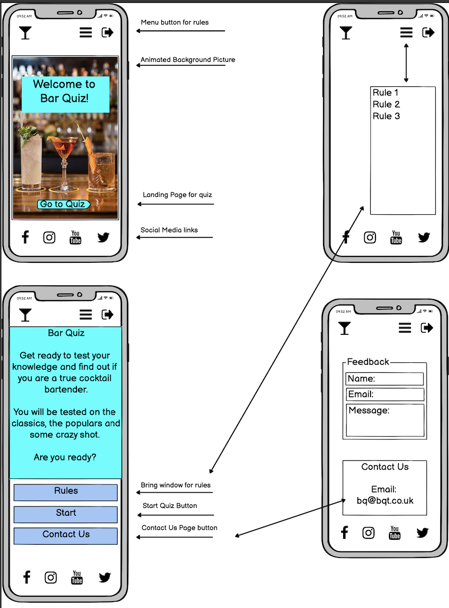 
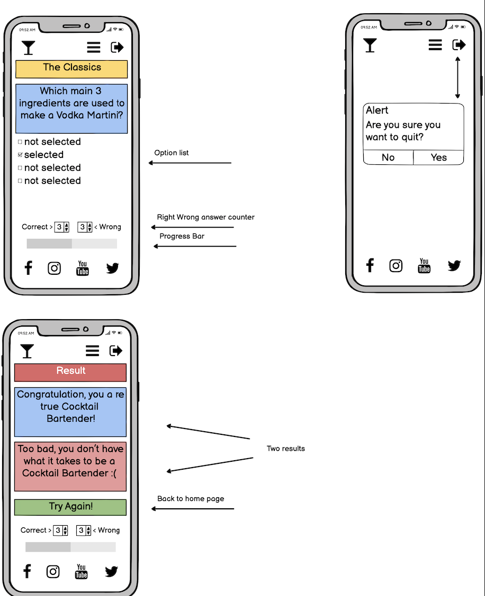 
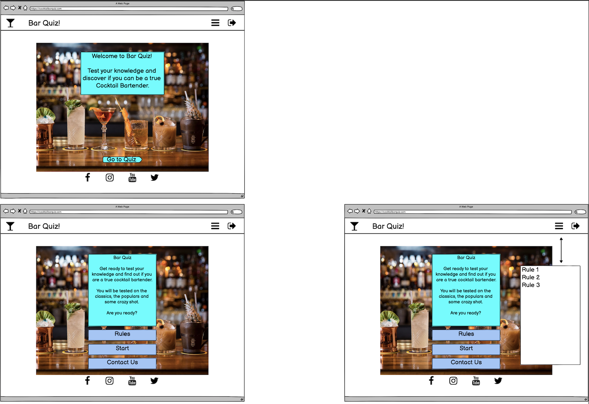 
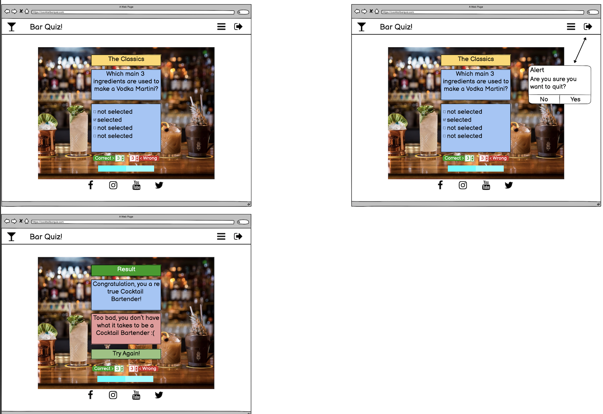 

  

[Top of the page](#top)

### <a name="deployment">4. Deployment </a> 

To deploy my website I have used GitHub. In order to do so I have followed the below steps:

- Create a repository on GitHub.
- Go to the list of repository in GitHub.
- Select the repository you wish to deploy, in my case Bar-Quiz repository.
- In the top navigation bar select Settings.
- On the left column list select Pages.
- Under Source click on the drop down arrow next to None and select Main and press Save. The page will refresh.
- The web address will appear. Example: https://mrbertieg.github.io/bar-quiz/index.html
- Refresh the page again and a green tick will appear next to the new web address.

  

[Top of the page](#top)

### <a name="manual-testing">5. Manual Testing</a>

TEST | ACTION | RESULT |
-----|:--------|--------|
Landing Page |Clicking on Top 5 Tom Cruises will take you to the Leaderboard Page. Clicking on "Go to Quiz" will take you to the quiz page| PASS
Leaderboard Page| Clicking on the House logo will take you to the Landing Page. Clicking on the "Home Button" will take you to the Landing Page | PASS
Quiz Page| Clicking on the Home Logo will take you to the Landing Page.   Clicking on the Rules button will open modal window.   Clicking on the Start button will open modal window with the Quiz.   Clicking on the Contact button will open a modal window with a feedback form.   Clicking on the X on the modal wildows will close the windows.   Clicking on "Take Test" will open a modal window with the quiz.   Clicking on the Exit Logo will open a modal window.   Clicking On "Yes" will send you to the Landing Page.   Clicking on "No" will close the exit modal.| PASS
Quiz Modal | Clicking on any of the 4 answers will trigger the next question to load.   Clicking on the X will close the quiz modal.   Completing the quiz will close the quiz modal window.| PASS
End Page | Clicking on the Home Logo will take you to the Landing Page.   Clicking on the "Save" buttion without entering a name will not save the score.   Entering a name in the input box and pressing "Save" will save the score and load the Landing Page.   Clicking on "Play Again" will take you to the Quiz Page where you can start again.   Clicking on "Go Home" will take you to the Landing Page. | PASS
Contact Form | Clicking "Leave Feedback!" button without entering a name and a valid email will not submit.   Entering a name and a valid email and a message will allow you to submit the form.   The "Clear" button will clear all of the information. | PASS
Text | All fonts and colours have been consistent throughout the website | PASS
Footer | The footer contains four social media icons. It is found on all three pages in the exact location on each page. The four social media icons are: Facebook, Instagram, Youtube, Twitter which when clicked, will redirect the user to their respective website. This will work on all three pages. | PASS

- Chrome Developer Tools Lighthouse. The Performance is overall good due to the minimal amount of images used on the website. The test was ran for the Mobile and Desktop Version.  

- Mobile Index Page  
 
- Mobile Quiz Page  
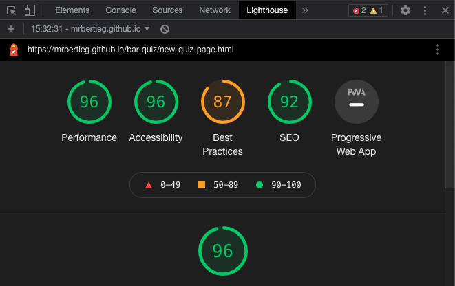 
- Mobile End Page  
 
- Mobile Leaderboard Page  
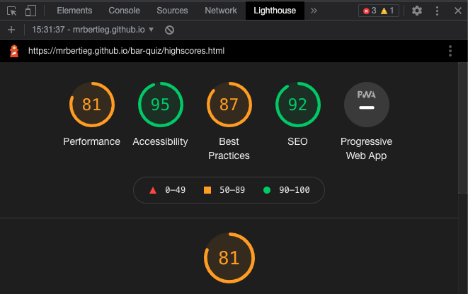 
- Desktop Index Page  
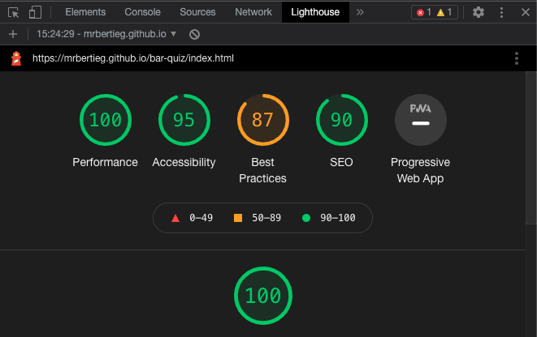 
- Desktop Quiz Page  
 
- Desktop End Page  
 
- Desktop Leaderboard Page  
 

- W3C Validator Index Page
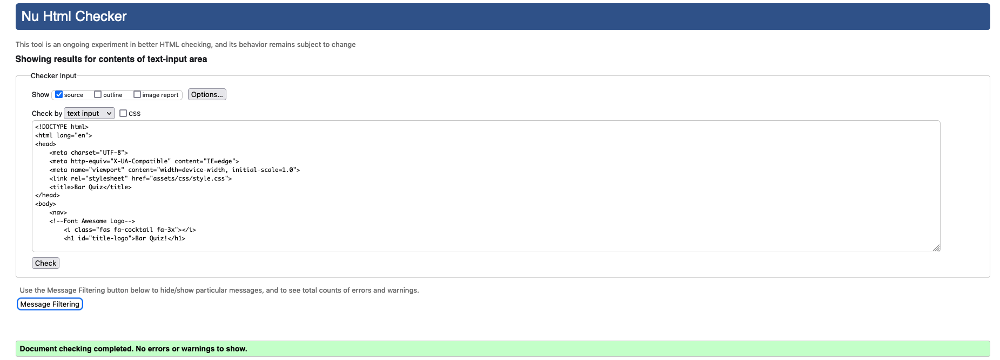
- W3C Validator Quiz Page

- W3C Validator End Page

- W3C Validator Leaderboard Page
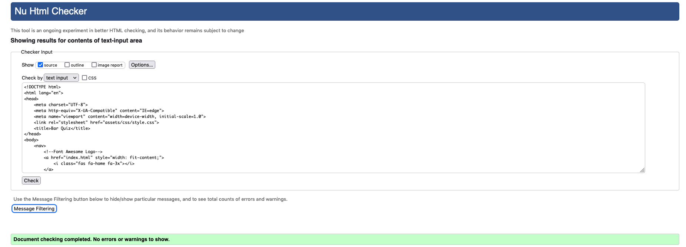
- Jigsaw CSS Validator
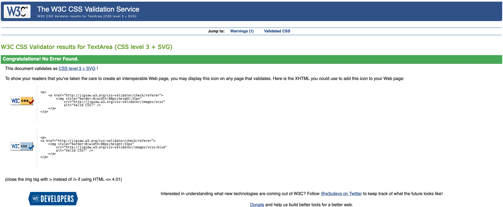
- JSHint Animations Validator
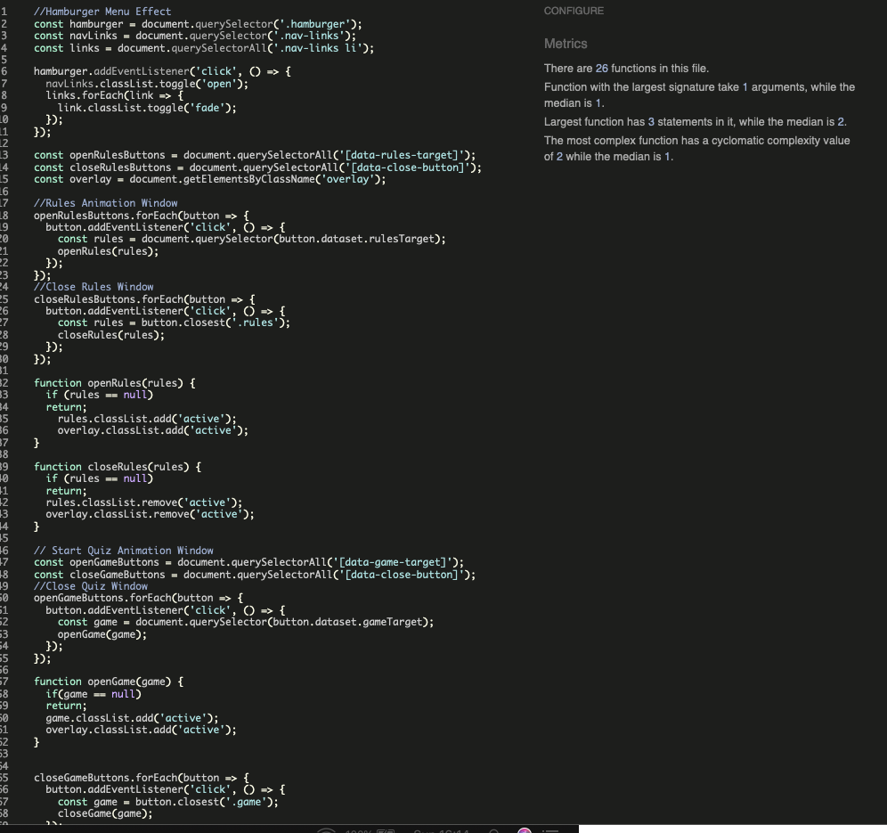
- JSHint End Page Validator
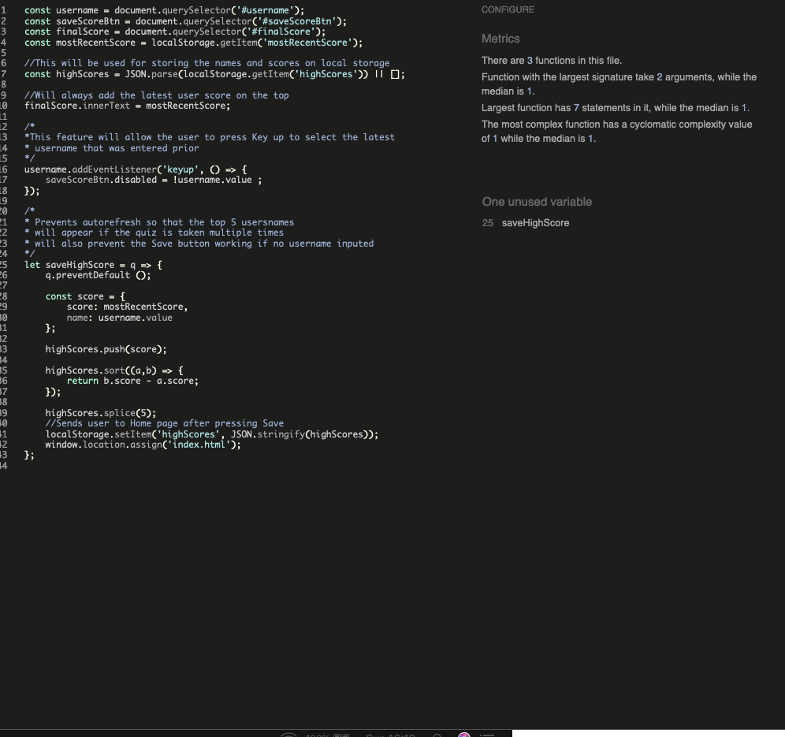
- JSHint Leaderboard Page Validator
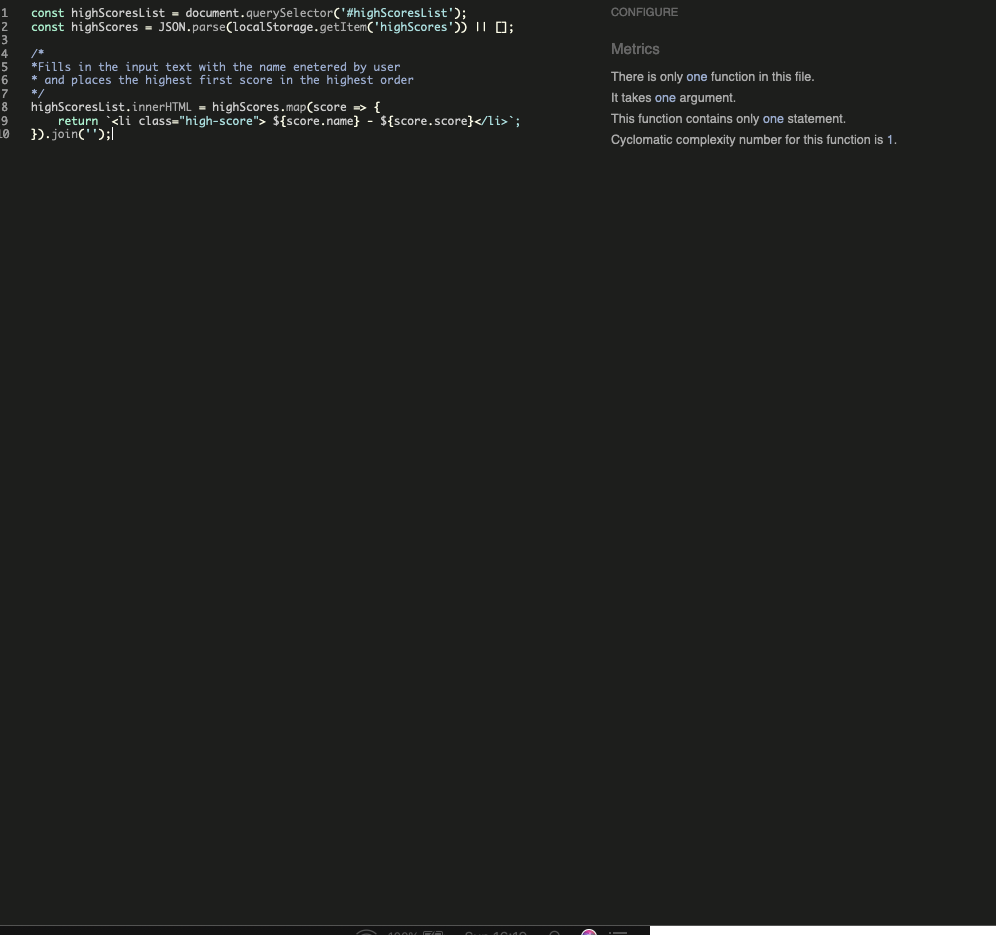
- JSHint Quiz Page Validator
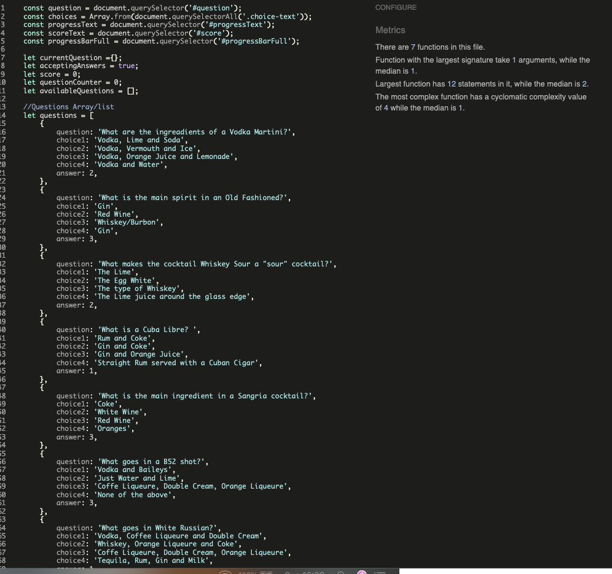

  

[Top of the page](#top)

### <a name="tech-used">5. Technologies Used</a>

- [HTML5](https://en.wikipedia.org/wiki/HTML5) HyperText Markup Language.
- [CSS3](https://en.wikipedia.org/wiki/CSS) Cascade Style Sheets.
- [GitHub](https://github.com/) is used to store the project by commiting changes and pushing them via a terminal.
- [GitPod](https://www.gitpod.io/) is used to code the website.
- [Balsamiq](https://balsamiq.com/) is used for the mockup of the website before coding. 
- [Mac Os Preview](https://support.apple.com/en-gb/guide/preview/welcome/mac) is a tool on MacBook used to view and make changes to image files. I used this to resize images in order to fit the website. 
- [Font Awesome](https://fontawesome.com/) is used for the footer icons. 
- [Google Fonts](https://fonts.google.com/) is used to implement the two fonts used in the website. Fira Sans and Oxygen. 
- [Google Chrome](https://www.google.co.uk/chrome/?brand=FHFK&gclid=CjwKCAjw4KyJBhAbEiwAaAQbE7E7ZbTy2V4OGQXkCgmeXbu-JV5E2tI_lsBDZJbPAwgteMPU3DRvnxoCj_wQAvD_BwE&gclsrc=aw.ds) Is used to preview the website throught the development cycle. 
- [Google DevTools](https://developers.google.com/web/tools) is used for tersting and also making changes in real time thriught the development process.
- [Eye Dropper](https://chrome.google.com/webstore/detail/eye-dropper/hmdcmlfkchdmnmnmheododdhjedfccka?hl=en) is a Chrome extension used to select colours and find out the rgba or hex combination of set colours. I used this to pick a colour from the sky of the main banner picture in the landing page in order to set the colour theme of the website. 
- [Unicorn Revealer](https://chrome.google.com/webstore/detail/unicorn-revealer/lmlkphhdlngaicolpmaakfmhplagoaln?hl=en-GB) is a Chrome extension used to preview margins of the Box Model CSS uses. It was particularly helpful to trouble shoot indentation issues and media query formating. 
- [Viewport Resizer](https://chrome.google.com/webstore/detail/viewport-resizer-%E2%80%93-respon/kapnjjcfcncngkadhpmijlkblpibdcgm?hl=en) is a Chrome extension used to simulate the viewport of various devices, from Mobile to Desktop. 
- [Readme](https://chrome.google.com/webstore/detail/readme-text-to-speech-rea/npdkkcjlmhcnnaoobfdjndibfkkhhdfn?hl=en-GB) is a Text-to-speach reader. This was particularly useful to use as it shows first hand what might visually impaired users would hear if the pictures can't be seen. 
- [W3C Markup](https://validator.w3.org/) and [Jigsaw](https://jigsaw.w3.org/css-validator/) validators are used to check the syntax of both languages.

  

[Top of the page](#top)

### <a name="bugs">7.Bugs</a>
- The main bug incountered was when the website was deployed and some pages displayed a " 404 page not found$ error. This was due to some file paths being written as an absolute file path and not as a relative path. Changing the path's structure has eliminated the bug. 
- The Contact modal was not centered to the page correctly.
- The Contact submission buttons did not have sufficient padding.
- The Header logo did not have sufficient padding. 
- The modal close X button was too small and not consistent with other pages

      

[Top of the page](#top)

### <a name="credits"> 8. Credits</a>
The following resources were used to get inspiration in creating this Website.  
- Youtube:
    - [Web Dev Simplified](https://www.youtube.com/channel/UCFbNIlppjAuEX4znoulh0Cw) for the creation of the modals.
    - [Dev Ed](https://www.youtube.com/c/DevEd) for the ceration of the menu overlay effect and animation.
- [Stack Overflow](https://stackoverflow.com/) (various posts) for the help in understanding certain functions and troubleshooting.
- [Slack](https://slack.com/intl/en-gb/) for the help provided throught the development process.
-[W3schools](https://www.w3schools.com/) for the hamburger menu inspiration.
