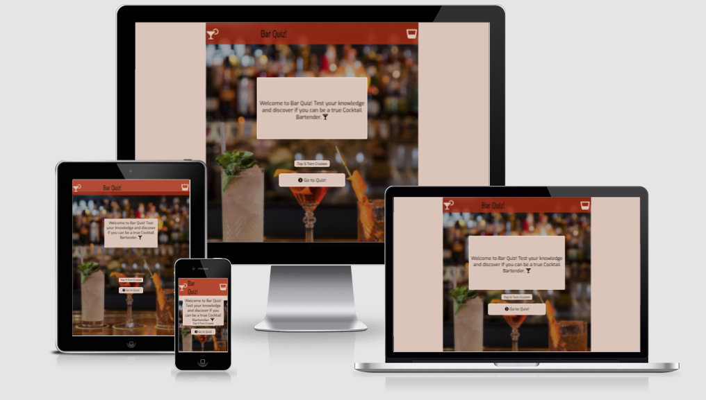

#Welcome to Bar Quiz Website

## Introduction

Bar Quiz is an interractive werbsite designed to engage with users and test their general knowlege on what the classic cocktails are made of.

  

# <a name="top">Table of Contents</a>

### [1. User Experience](#user-ex) 

### [2. Features](#features)
- Navigation Bar
- Home Page
- Quiz Page
- Leaderboard Page
### [3. Wireframe](#wireframe)
### [4. Deployment](#deployment)
### [5. Manual Testing](#manual-testing)
### [6. Technologies Used](#tech-used)
### [7. Bugs](#bugs)
### [8. Credits](#credits)

  
[Index](#top)

## <a name="user-ex">1. User Experience</a>

### A user visiting the website would expect the following:

### A returning user visiting the website:

  

### Design Approach

## <a name="features">2. Features</a>
[Index](#top)
### Navigation 
- The navigation bar has four different versions depending on which page the user is and on what size screen the user is using. 

Mobile Home Page

Mobile Quiz Page

Mobile Leaderboard and End Page 

Mobile Overlay Effect when pressint the menu

- In screens bigger than 500px the nav bar menu has a animation effect where text increases size and changes colour. 

  

[Index](#top)

### Header 

  

[Index](#top)

### External Links Section 

  

[Index](#top)

### Visit Folkestone Video 

  

[Index](#top)

## Footer  

  

[Index](#top)

### Town Tour

  

[Index](#top)

### Contact

  

[Index](#top)

### <a name="wireframe">3. Website Wireframe</a>

Mobile 

Tablet

Web Browser

  

[Index](#top)

### <a name="manual-testing">4. Manual Testing</a>

TEST | ACTION | RESULT |
-----|:--------:|--------|
Landing Page | Clicking on the Logo, Title, and Main Picture banner will redirect to the main landing page. Clicking on the video will play with no issues. All other links in the landing page will redirect the user to external pages. All links work correctly.| PASS
Town Tour Page | Clicking "Town Tour" tab in the nav bar will redirect you to the second page of the website. Should the user wish to return to the Landing Page then this can be achieved by clicking the picture logo or Visit Folkestone title. All images have been tested, and will redirect the user successfully to external pages. | PASS
Contact Page | Clicking "Contact" tab in the nav bar will redirect you to the third page of the website. Should the user wish to return to the Landing Page then this can be achieved by clicking the picture logo or Visit Folkestone title. The submission form will send the information successfully to https://formdump.codeinstitute.net/ . The google maps interractive map also works successfully. | PASS
Text | All fonts and colours have been consistent throughout the website | PASS
Footer | The footer contains four social media icons. It is found on all three pages in the exact location on each page. The four social media icons are: Facebook, Instagram, Youtube, Twitter which when clicked, will redirect the user to their respective website. This will work on all three pages. | PASS

- Chrome Developer Tools Lighthouse. The Performance is in the amber zone due the the picture sizes. Visit Folkestone is a website designed to attract visitors so the aim is for the pictures to be as clear and high definition as possible to entice people to come over. The Website still performes well.

- W3C Validator Index Page.

- W3C Validator Town Tour Page.

- W3C Validator Contact Page.

- Jigsaw Validator.

  

[Index](#top)

### <a name="tech-used">5. Technologies Used</a>

- [HTML5](https://en.wikipedia.org/wiki/HTML5) HyperText Markup Language.
- [CSS3](https://en.wikipedia.org/wiki/CSS) Cascade Style Sheets.
- [GitHub](https://github.com/) is used to store the project by commiting changes and pushing them via a terminal.
- [GitPod](https://www.gitpod.io/) is used to code the website.
- [Balsamiq](https://balsamiq.com/) is used for the mockup of the website before coding. 
- [Mac Os Preview](https://support.apple.com/en-gb/guide/preview/welcome/mac) is a tool on MacBook used to view and make changes to image files. I used this to resize images in order to fit the website. 
- [Font Awesome](https://fontawesome.com/) is used for the footer icons. 
- [Google Fonts](https://fonts.google.com/) is used to implement the two fonts used in the website. Fira Sans and Oxygen. 
- [Google Chrome](https://www.google.co.uk/chrome/?brand=FHFK&gclid=CjwKCAjw4KyJBhAbEiwAaAQbE7E7ZbTy2V4OGQXkCgmeXbu-JV5E2tI_lsBDZJbPAwgteMPU3DRvnxoCj_wQAvD_BwE&gclsrc=aw.ds) Is used to preview the website throught the development cycle. 
- [Google DevTools](https://developers.google.com/web/tools) is used for tersting and also making changes in real time thriught the development process.
- [Eye Dropper](https://chrome.google.com/webstore/detail/eye-dropper/hmdcmlfkchdmnmnmheododdhjedfccka?hl=en) is a Chrome extension used to select colours and find out the rgba or hex combination of set colours. I used this to pick a colour from the sky of the main banner picture in the landing page in order to set the colour theme of the website. 
- [Unicorn Revealer](https://chrome.google.com/webstore/detail/unicorn-revealer/lmlkphhdlngaicolpmaakfmhplagoaln?hl=en-GB) is a Chrome extension used to preview margins of the Box Model CSS uses. It was particularly helpful to trouble shoot indentation issues and media query formating. 
- [Viewport Resizer](https://chrome.google.com/webstore/detail/viewport-resizer-%E2%80%93-respon/kapnjjcfcncngkadhpmijlkblpibdcgm?hl=en) is a Chrome extension used to simulate the viewport of various devices, from Mobile to Desktop. 
- [Readme](https://chrome.google.com/webstore/detail/readme-text-to-speech-rea/npdkkcjlmhcnnaoobfdjndibfkkhhdfn?hl=en-GB) is a Text-to-speach reader. This was particularly useful to use as it shows first hand what might visually impaired users would hear if the pictures can't be seen. 
- [W3C Markup](https://validator.w3.org/) and [Jigsaw](https://jigsaw.w3.org/css-validator/) validators are used to check the syntax of both languages.

  

[Index](#top)

### <a name="deployment">6.Deployment</a>

 

  

[Index](#top)

### <a name="bugs">7.Bugs</a>

      

[Index](#top)

### <a name="credits"> 8. Credits</a>

